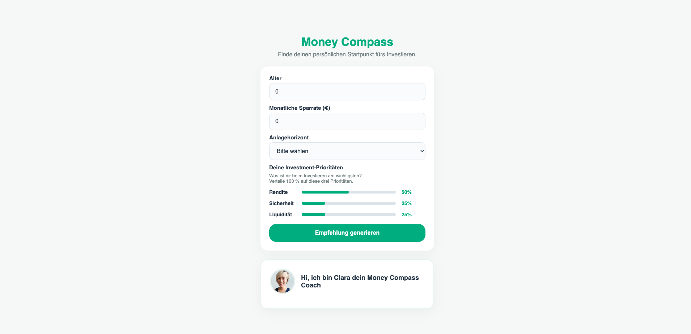

# Money Compass – AI Investment Recommendation System (In Development)

Money Compass is a prototype of an AI-powered investment recommendation system currently in development.

It combines user input, structured decision logic, and a Large Language Model (LLM) to generate simple, human-friendly investment guidance for beginners.

---

## Overview

The system consists of:

- a React frontend for user interaction  
- a backend service API (in development)  
- an AI layer using prompt-based logic and Retrieval-Augmented Generation (RAG)  

The goal is to translate financial concepts into clear, accessible explanations.

## Preview

  

---

## AI Approach

The recommendation flow is based on:

- prompt engineering for decision logic  
- LLM-generated responses  
- RAG-style context retrieval using portfolio documents  

This allows the system to combine structured logic with natural, conversational explanations.

---

## Repositories

Frontend (Playground)  
[Frontend Repository](https://github.com/kristina-krauberger/money-compass-playground/)

Backend (Service API – WIP)  
[Backend Repository](https://github.com/kristina-krauberger/money-compass-api)

---

## Tech Stack

React, Vite  
Python, Flask  
LLM integration  
Prompt Engineering  
RAG (context-based explanations)

---

## Status

In development  
Frontend playground available  
Backend currently being built  

---

## About

This project explores how LLMs, prompt design, and RAG can be combined to create simple and user-friendly financial guidance tools.

Focus: system design, AI integration, and product thinking.
